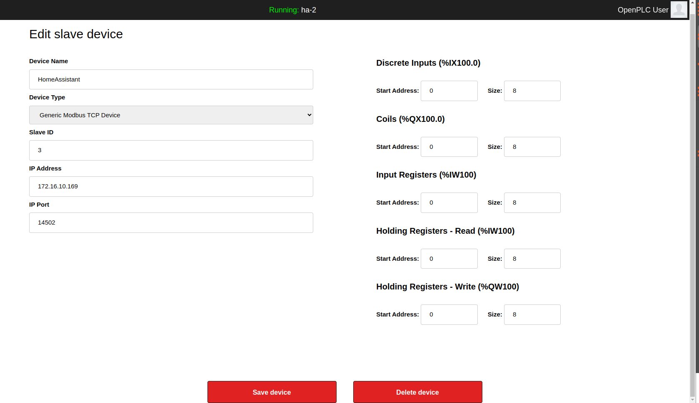

<td style="width: 20%;"></td>

# Índice

- [Introdução](#Introdução)
- [NodeRED Modbus](#NodeRED-Modbus)

# Home Assistant e OpenPLC

## Introdução ao protocolo Modbus

O OpenPLC é capaz de se comunicar com outros dispositivos utilizando o protocolo Modbus, um padrão industrial criado pela Modicon nos anos 70. Esse protocolo é amplamente utilizado para a comunicação entre controladores lógicos programáveis (PLCs) e outros dispositivos.

O Modbus é um protocolo mestre/escravo, o que significa que um dispositivo atua como mestre e controla um ou mais dispositivos escravos. No contexto do Modbus, existem conjuntos de dados chamados coils e registers. Coils são variáveis booleanas (bits) e registers são números inteiros de 16 bits. Eles funcionam como endereços de memória, ou seja, são nomes de variáveis pré-definidas utilizadas para armazenar informações.

Existem quatro tipos de dados no Modbus: discrete inputs (entradas discretas, representando booleanos apenas de leitura), coils (bobinas, que são booleanos de leitura e escrita), input registers (registros de entrada, que são inteiros apenas de leitura) e holding registers (registros de armazenamento, que são inteiros de leitura e escrita).

Esses endereços de memória estão localizados no dispositivo escravo ou servidor, que é o dispositivo que responde aos comandos enviados pelo mestre ou cliente. O número de coils e registers presentes em um dispositivo depende do fabricante e modelo específico.

Quando o software no dispositivo mestre utiliza o protocolo Modbus para enviar um pedido, especificando os endereços de interesse, o dispositivo escravo responde com uma resposta contendo os dados solicitados. Caso o mestre não emita um pedido, o escravo permanece em silêncio, aguardando novas solicitações.

## NodeRED Modbus

Para esta integração, será utilizado o **node-red-contrib-modbus**, um pacote do Node-RED que possibilita o uso de Modbus TCP, permitindo que seja adicionado um Modbus Server no fluxo, que será utilizado para integrar o OpenPLC ao Home Assistant. A imagem abaixo mostra o fluxo completo que sera utilizado neste tutorial. Este fluxo esta presente no repositório no arquivo [**Modbus.json**](Modbus.json) e pode ser importado diretamente no Node RED para ser editado e utilizado. Além disso, fotos das configurações de nodos utilizados no fluxo encontram-se em [imagens/](imagens).


### Configuração do Modbus Server

Para configurar o nodo Modbus-Server, escolha uma porta para a comunicação Modbus e um hostname do master que irá se conectar a ele. Para permitir que qualquer master se conecte a ele, utilize o hostname 0.0.0.0


### Funções para atribuir manualmente os valores no Modbus Server

Para testar o nodo Modbus server, podemos utilizar as funções abaixo, que ajustam o payload da mensagem a ser enviada ao Modbus Server de acordo com o payload da mensagem de entrada. No exemplo acima, o nodo Inject foi utilizado para atribuir valores zero aos registradores.


- Set discrete input register

```JavaScript
msg.payload = {
    value: msg.payload,
    register: "discrete",
    address: 0,
    disablemsg: 1,
};
return msg;
```

- Set coils register

```JavaScript
msg.payload = {
    value: msg.payload,
    register: "coils",
    address: 0,
    disablemsg: 1,
};
return msg;
```

- Set holding register

```JavaScript
msg.payload = {
    value: msg.payload,
    register: "holding",
    address: 0,
    disablemsg: 1,
};
return msg;
```

- Set input register

```JavaScript
msg.payload = {
    value: msg.payload,
    register: "input",
    address: 0,
    disablemsg: 1,
};
return msg;
```

### Funções para leitura do Modbus Server

No protocolo modbus, defini-se que coils são variáveis booleanas (bits) e registers são números inteiros de 16 bits. Contudo, o NodeRED armazena estas variáveis como bytes no Modbus Server. Portanto, é necessário fazer uma conversão para obter os bits individuais das coils e os inteiros de 16 bits dos registers. As funções a seguir realizam esta conversão:

- **Get Registers**: recebe o valor dos registradores como bytes e retorna um array de inteiros de 16 bits, onde in inteiro de 16 bits é formado concatenando os bits de bytes consecutivos.

  

```JavaScript
function getRegisters(n_registers) {
    let mylist = [];
    for (let k = 0; k < n_registers; k++) {
        (msg.payload[0] << 8) + msg.payload[1];
        mylist.push((msg.payload[k * 2] << 8) + msg.payload[k * 2 + 1]);
    }
    return mylist;
}
msg.payload = getRegisters(msg.N_REGISTERS);
return msg;
```

- **Get Bits**: recebe o valor das coils como bytes e retorna um array de bits, formados a partir dos bits que compõem cada byte.

  

```JavaScript
let bits = (n, b) => [...Array(b)].map((x, i) => (n >> i) & 1);

function getBits(n_bytes) {
    let mylist = [];
    for (let k = 0; k < n_bytes; k++) {
        mylist.push(bits(msg.payload[k], 8));
    }
    return mylist;
}

msg.payload = getBits(msg.N_BYTES).flat();
return msg;
```

As funções acima dependem de valores **msg.N_REGISTERS** e **msg.N_BYTES**, que informam o número de registers a serem retornados e o número de bytes para converter para bits, respectivamente. Esses valores podem ser configurados utilizando nodos **change**


## Criando entidades para o Dashboard do Home Assistant

Para que o usuário do Home Assistant possa interagir com o Modbus Server, é necessário criar entidades que permitam a visualização de dados e envio de comandos à partir da interface gráfica. Para isso podem ser criadas entidades ajudantes para definir valores a serem enviados para o Modbus Server e configuradas entidades dentro do NodeRED para exportar valores lidos através do Node-RED Companion Integration.

### Entidades Ajudantes

Foi criada uma entidade ajudante do tipo **input_number** como mostrado na imagem abaixo. Na interface gráfica, esta entidade tem nome de **Número** e pode ser criada clicando em **Configurações** -> **Dispositivos & Serviços** -> **Entidades Ajudantes** -> **Criar Ajudante** -> **Número**. Neste exemplo, a entidade representará uma temperatura alvo para um alto forno e tem o nome modbus_target_temperature.


Para realizar mudanças no Modbus server a partir do valor da entidade ajudante, utilizou-se o nodo **events: state** para disparar um evento quando o valor mudar e ficar estável por 3 segundos. Isso evita que valores sejam enviados enquanto o usuário desliza a barra da Entidade Ajudante. Em seguida, a função **Set target temperature** escreve o valor no primeiro registrador (2 primeiros bytes).


- Set Target Temperature

```JavaScript
msg.payload = {
    value: [msg.payload >> 8, msg.payload & 0xff],
    register: "input",
    address: 0,
    disableMsgOutput: 0,
};
return msg;
```

### Node-RED Companion Integration

Para configurar entidades do Home Assistant dentro do NodeRED e exportar os valores do Modbus Server recebidos, é necessário instalar o HACS Node-RED Companion Integration. Instruções para intalação do HACS e integrações custom estão disponíveis em [HomeAssistant-HACS](https://github.com/Epaminondaslage/HomeAssistant-HACS).

Apos instalar o HACS, esta integração pode ser encontrada em **Configurações** -> **Dispositivos & Serviços** -> **+ ADICIONAR INTEGRAÇÃO** -> **Node-RED Companion**. Uma vez instalado, os nodos aparecem no menu de nodos.


Neste exemplo, foram criadas entidades **binary sensor** e **sensor**, representando o estado e um LED e uma leitura de temperatura, respectivamente. As configurações destes nodos encontram-se abaixo:


## Comunicando a partir de dispositivos externos

Qualquer dispositivo capaz de se comunicar via modbus pode interagir com o Modbus Server criado nas seções anteriores. Nesta seção, serão mostrados exemplos a partir de um script Python utilizando a biblioteca PyModbus e a partir do OpenPLC.

### PyModbus

Este script simula a comunicação de um PLC controlando um Alto forno. Ele se conecta a Modbus Server criado no NodRED e lê os valores das coils e registradores. Em seguida, ele assume que o Input Register de endereço zero corresponde à temperatura alvo, gera um valor de temperatura aleatório em torno da temperatura alvo e escreve este valor no Holding Register de endereço zero.

```python
from pymodbus.client import ModbusTcpClient
import time
from random import randint

def bitString(boolList):
    return "".join(["1" if x else "0" for x in boolList])


client = ModbusTcpClient(
    host="192.168.0.216", port=14502, unit_id=1, retry_on_empty=True
)
client.connect()

time.sleep(1)

result_coils = client.read_coils(0, 16)
result_discrete_inputs = client.read_discrete_inputs(0, 16)
result_holding_registers = client.read_holding_registers(0, 3)
result_input_registers = client.read_input_registers(0, 3)

print("Coils:", bitString(result_coils.bits))
print("Discrete_inputs:", bitString(result_discrete_inputs.bits))
print("Holding_registers:", result_holding_registers.registers)
print("Input_registers", result_input_registers.registers)
print()

time.sleep(1)

TARGET_TEMPERATURE = result_input_registers.registers[0]
TEMPERATURE = TARGET_TEMPERATURE + randint(-50, 50)
print("Target temperature:", TARGET_TEMPERATURE)
print("Random temperature:", TEMPERATURE)
print()

client.write_register(0, TEMPERATURE)
client.close()
```

A execução do script altera o valor dos registradores no Modbus server, mas isso não gera um disparo de evento para que a entidade do Home Assistant seja atualizada. Para garantir que as entidades estejam sincronizadas com o Modbus Server, um nodo **inject** temporizado foi utilizado. Ele dispara a cada 10 segundos e sincroniza os valores do Modbus Server com as entidades do Home Assistant.


Dashboard antes da execução do script:


Dashboard após a execução do script:


Saida da execução do script Python


## OpenPLC

Para demonstrar a comunicação do OpenPLC com o Home assistant, fez-se um programa para monitorar o estado de um LED. Este estado é então escrito na coil de endereço zero e mostrada no Dashboard do Home Assistant como explicado nas seções anteriores. Podemos ver nas imagens abaixo a mudança de estado na interface gráfica quando o estado do LED é alterado.


Abaixo podemos ver a configuração do Modbus Server do NodeRED na interface WEB do OpenPLC. Escolha a opção **Generic Modbus TCP Device**, o IP e porta do Modbus Server.




# Sites relacionados ao Home Assistant - OpenPLC com Node-RED

- Site oficial do OpenPLC: https://openplcproject.com/
- Site do HACS Node-RED Companion Integration: https://github.com/zachowj/hass-node-red

# Status do Projeto


